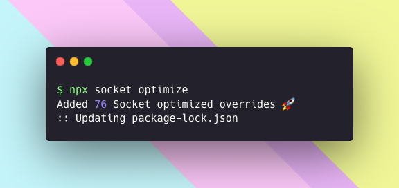

# @socketregistry

[](https://github.com/SocketDev/socket-registry/actions/workflows/_local-not-for-reuse-ci.yml)

[](https://twitter.com/SocketSecurity)
[](https://bsky.app/profile/socket.dev)

> Optimized package overrides for improved security, performance, and
> compatibility with [Socket Optimize](https://socket.dev/features/optimize).



## Quick Start

```bash
npx socket optimize
```

This command analyzes your dependencies and suggests optimized replacements from
the Socket Registry.

## What Are Package Overrides?

Package overrides are improved versions of existing npm packages that:

- **Cleanup** ✨ — Reduce dependencies and replace polyfills with built-in
  equivalents
- **Levelup** 🧩 — Add new features and leverage modern platform APIs
- **Speedup** ⚡ — Boost performance with optimized implementations
- **Tuneup** 🔧 — Address CVEs in outdated or unmaintained packages

## Quality Standards

All overrides in this registry:

- Pass original package tests to maintain compatibility 💯
- Work seamlessly with CommonJS and ESM
- Retain original licenses and are MIT compatible
- Include
  <a href="https://www.typescriptlang.org/"></a>
  TypeScript definitions
- Support current and [LTS](https://nodejs.org/en/about/previous-releases) Node
  versions

## Using the Registry Library

Install the registry support package for programmatic access to metadata and
helper methods:

```bash
pnpm install @socketsecurity/registry
```

See the [registry README](./registry/README.md) for API documentation.

## Contributing

Create a new override in three simple steps:

1. **Install dependencies:**

```bash
pnpm install
```

2. **Run the wizard:**

```bash
pnpm run make:npm-override [<package-name>]
```

3. **Complete the override:**
   - Follow the prompts to scaffold your override
   - Fill in all `TODO:` commented sections
   - Run tests with `pnpm test`
   - Commit and send a pull request

Inspired by [e18e](https://e18e.dev/).
