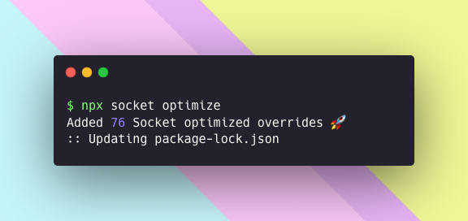

# @socketregistry

[](https://socket.dev/npm/package/@socketsecurity/registry)
[](https://github.com/SocketDev/socket-registry/actions/workflows/ci.yml)


[](https://twitter.com/SocketSecurity)
[](https://bsky.app/profile/socket.dev)

Optimized package overrides for [Socket Optimize](https://socket.dev/features/optimize).



## Why this repo exists

`@socketregistry` is the monorepo behind [Socket Optimize](https://socket.dev/features/optimize) — a curated set of drop-in npm package replacements that reduce dependencies, modernize APIs, improve performance, and patch known CVEs without breaking compatibility. Every override passes the original package's own test suite, ships with TypeScript types, and stays MIT-compatible. The registry exists so `socket optimize` has something authoritative to swap in.

## Install

Install the Socket CLI globally, then run it inside any project:

```sh
# pnpm (recommended)
pnpm add -g socket

# npm
npm install -g socket

# yarn
yarn global add socket
```

## Usage

From your project root:

```sh
socket optimize
```

`socket optimize` analyzes your dependencies and suggests optimized replacements from the Socket Registry.

### What are package overrides?

Package overrides are improved versions of existing npm packages:

```
Original Package          Socket Override
     ↓                         ↓
  Cleanup  ✨  →  Reduce dependencies, use built-ins
  Levelup  🧩  →  Add features, modern APIs
  Speedup  ⚡  →  Optimize performance
  Tuneup   🔧  →  Fix CVEs, maintain compatibility
```

### Quality standards

All overrides in this registry:

- Pass original package tests to maintain compatibility 💯
- Work seamlessly with CommonJS and ESM
- Retain original licenses and are MIT compatible
- Include
  <a href="https://www.typescriptlang.org/"></a>
  TypeScript definitions
- Support current and [LTS](https://nodejs.org/en/about/previous-releases) Node versions

## Development

<details>
<summary>Contributor commands</summary>

Create a new override in three steps:

```
Step 1              Step 2                  Step 3
Install       →     Generate          →     Complete
  ↓                   ↓                       ↓
pnpm install    make-npm-override    Fill TODOs + Test
```

</details>

## License

MIT
